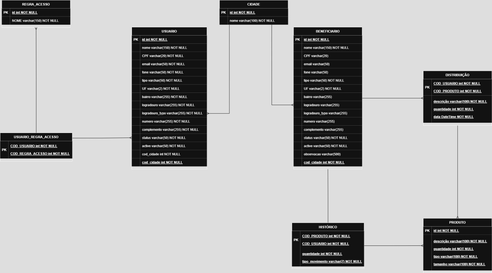

# donate-app-back

# Backend para gerenciar as doações da SANEM
## MER

[donation-app-MER.drawio](src/main/resources/static/donation-app-MER.drawio)

## Tecnologias usadas
    -Java 17
    -Spring Boot 3.x
    -Mysql
    -Docker

### Desenvolvedores
    - Fernando (backend)
    - Julia (frontend)
    - Jiliana (frontend)
    - Diego (AM e frontend)